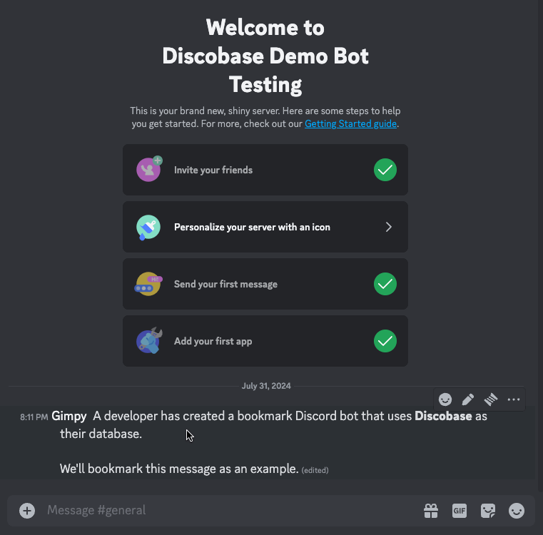

---
hide:
    - navigation
---

# Demonstration

Now, we know that Discobase's main functionality is just a database for storing data: we're allowing developers to access this "database" to make their own applications.

Quotes are applied around the term database because, as mentioned earlier, the database is actually a Discord server created by the user (or by the Discobase bot in many cases), making Discobase the intermediary to couple this connection.

If we look at the scenairo below, a developer&mdash;from our team&mdash;has programmed a message bookmarking bot that uses the Discord context menu feature `App -> Bookmark` to store away the message onto the database.

This bot doesn't use any other database &mdash; no SQL, no MongoDB, nothing! Just our very own library, which stores it on a Discord server.

After storing away our pertinent message to the database, we can use a slash command as per the developer's generous design to get all the bookmarks we've stored away.

If you want to try this for yourself, you can [invite the bookmark bot](https://discord.com/oauth2/authorize?client_id=1268247436699238542&permissions=8&integration_type=0&scope=bot) to your server.
