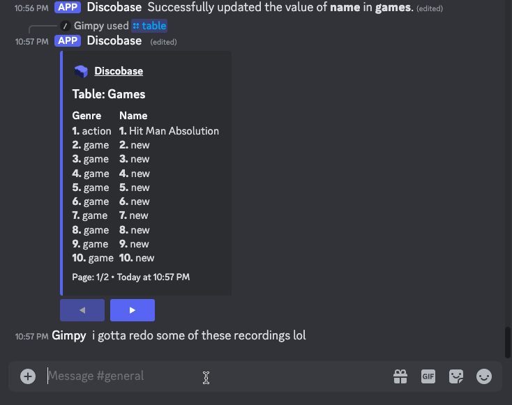
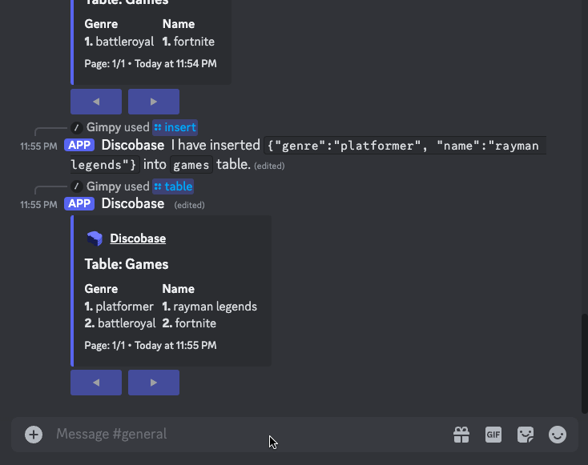

---
hide:
    - navigation
---

# Discord Interface

A handful of essential commands are readily available for interacting with the Discobase discord bot.

!!! note

    The commands shown in the example section will generally have a interface provided by Discord.
    In these examples, we use a **Games** table which has the columns: **Name** and **Genre**.

## Access the Table's Schema

Checkout the data type for the columns in your table before performing `insert` or `update` operations.

The `/schema` operation takes in the name of your table as input and outputs information such as the names of columns and their datatypes you have set them to.

### Usage

`/schema [table]`

-   **Table:** The name of the table you've created.

### Example

`/schema Games`

!!! warning "Limitation"

    -   Considering the limit of fields is 25 on discord. The command can only show up to 25 columns, so we'll signify the limit as `field_length = 25` forming the following inequality: **C** <= `field_length` where **C** is the number of columns.

## Update a Column's Value

Users can modify the arbitrary value they have set to a specific column in their data; however, the data type has to be consistent with the column's data type.

The `/update` slash command takes the following parameters: the name of the table, the name of the column, the old value, and the new value that should replace the old one.

### Usage

`/update [table] [column] [current_value] [new_value]`

-   **Table:** The table you want to perform an update on.
-   **Column:** The column you want to update.
-   **Current Value**: The current value saved in the column.
-   **New Value**: Your new information.

### Example

`/update Games name Hit Man Absolution Tomb Raider`

!!! warning "Limitation"

    The user is disallowed from entering a new value that is not consistent with the predefined column's data type.

## Retrieve Statistics Concerning Your Database

Knowing pertinent information such as how many tables are in my database and what are the names of each table are easily answered using this command.

`/tablestats` iterates over your database's tables to display the names you've assigned to them and it tallies up a count of how many you've made.

### Usage

`/tablestats`

-   There are no parameters for this command.

### Example

`/tablestats`

## Perform a Search on Your Data

Finding information in your data is an essential task.

The slash command `/find`will ask for the following information before performing a search such as the name of the table, the name of the column, and the value you want to look up.

### Usage

`/find [table] [column] [current_value]`

-   **Table:** The name of the table the column is in.
-   **Column:** The name of the column.
-   **Current Value**: The value to search for.

### Example

`/find Games name Batman`

!!! warning "Limitation"

    The `description` field in a rich embed is limited to `4096` characters. The searching being performed on the data only looks for an exact match.

## Inserting a New Record Into Your Table

The `/insert` command allows you to add data to your table directly from your discord database server, saving you from having to restart your bot to add additional records.

### Usage

`/insert [table] [record]`

-   **Table:** The table you want to insert a new record into.
-   **Record:** The record you want to insert, formatted as JSON. Use the columns as keys, and record data as values.

### Example

`/insert games {"name": "rayman legends", "genre": "platformer"}`

## Deleting a Record From Your Table

The `/delete` command allows you to delete a record from your table within your Discord database server. Just like `/insert`, it saves you from having to restart your bot just to delete a record.

### Usage

`/delete [table] [record]`

-   **Table:** The table you want to delete a record from.
-   **Record:** The record you want to delete, formatted as a json. Use the columns as keys, and record data as values.

### Example

`/delete games {"name": "rayman legends", "genre": "platformer"}`

## Resetting Your Database

Ever had a large database that you simply do not know what to do with anymore? The `/reset` command makes it easy to remove all records and tables from your database and start fresh within a couple seconds! No need to make a whole new database server.

### Usage

`/reset`

-   There are no parameters for this command.

## Viewing a Table

The `/table` command displays a table in a nicely formatted rich embed, with the columns as field titles, and the records from those columns as the field descriptions. The data is numbered so that you can easily correlate each record with its group.

### Usage

`/table [name]`

-   **Name:** Name of the table.

### Example

`/table games`

!!! warning "Limitation"

    -   Considering the limit of fields is 25 on discord. The command can only show up to 25 columns, so we'll signify the limit as `field_length = 25` forming the following inequality: **C** <= `field_length` where **C** is the number of columns.
    -   Field titles have a character limit of 256 characters, therefore some titles may be cut off with an ellipsis at the end.

## Viewing a Column

The `/column` command displays a column from a page in a neat, paginated rich embed to visualize the column data.

### Usage

`/column [table] [name]`

-   **Table:** The table the column belongs to.
-   **Name:** Name of the column.

### Example

`/column games name`

!!! warning "Limitation"

    Embed descriptions have a character limit of `4096`, so some particularly large data may not fit within the bounds.
